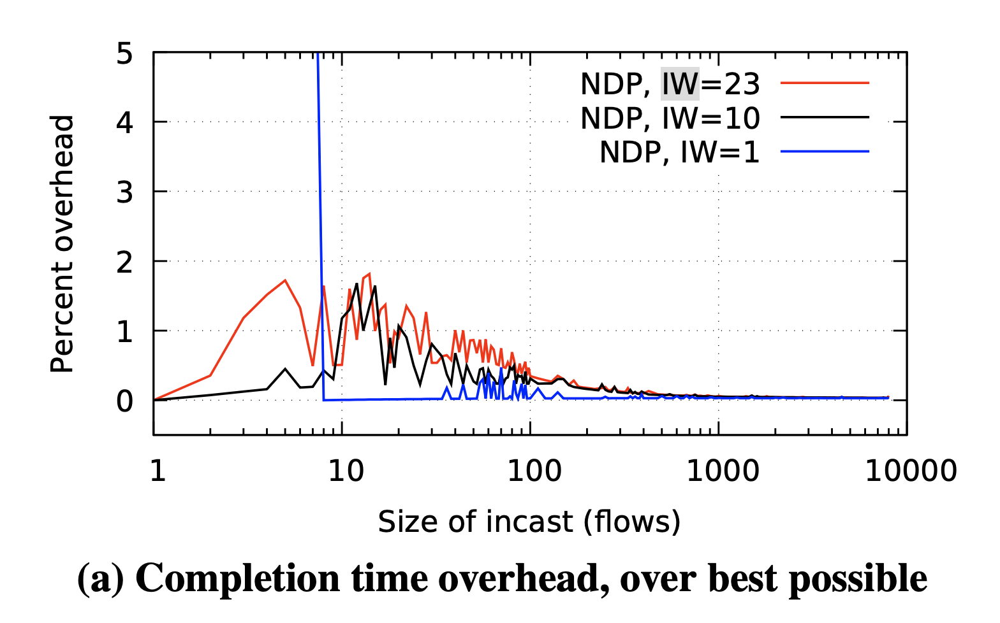
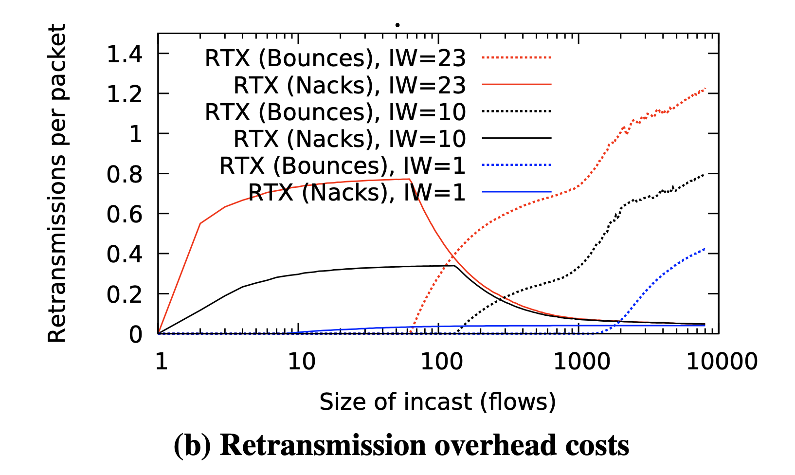
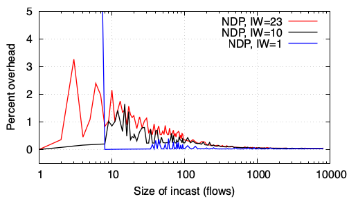
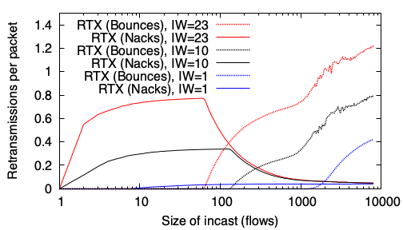
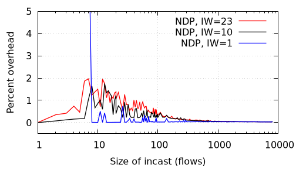
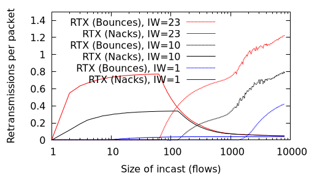
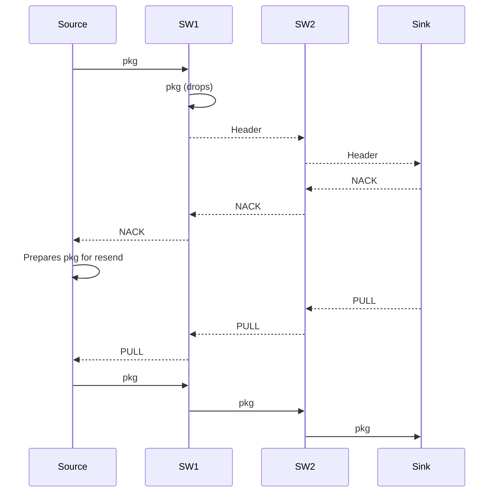
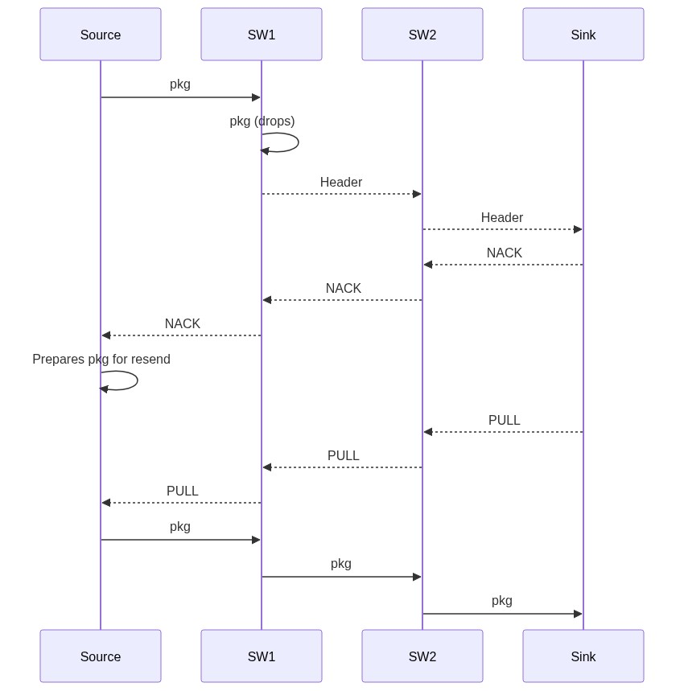
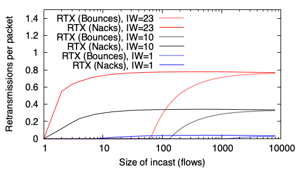
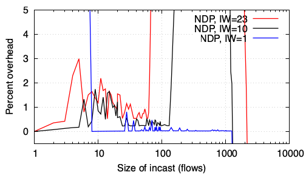

# Replicating: "Re-architecting datacenter networks and stacks for low latency and high performance"

**Team Members:**  
Davide Collovigh (davide.collovigh@mail.polimi.it);

---

**Source Paper:**
Mark Handley, Costin Raiciu, Alexandru Agache, Andrei Voinescu, Andrew W. Moore, Gianni Antichi, Marcin Wójcik: Re-architecting datacenter networks and stacks for low latency and high performance. In "SIGCOMM '17", "Association for Computing Machinery".


**Project:**
[NDP](https://github.com/Dav-11/NDP)

---

# 1. Introduction

The paper proposes a new data-center transport architecture called NDP. This architecture, they say, achieves near-optimal completion
times for short transfers and high flow throughput in a wide range of scenarios, including incast.
NDP is designed to work in datacenters using redundant (clos-like) topologies, and requires some operations to be carried out by switches.


## 1.1 The problem
The problem this paper tries to address is the design of an architecture that can target both low latency and high throughput. In datacenter networks latency sensitive workloads and high throughput workloads coexist. Some examples of these workloads can be:
- High throughput workloads:
  - Remote disks in virtualization (storage for VMs is not located on the same server as the VM).
  - Distributed Storage (Storage is replicated between servers).
  - Backups and replications.
  - Data movement between computing nodes in AI training workload.
- Latency sensitive workloads:
  - Database queries
  - RPC requests
  - Video/audio streaming

Since datacenters want to support the widest range of workloads it is a very valuable result for them.

## 1.2 The solution
To fully satisfy these goals, NDP impacts the whole stack, including switch behavior, routing, and a completely new transport protocol.
<!-- - A Clos topology has sufficient bandwidth in the core to satisfy all demand, so long as it is perfectly load-balanced.
- per-packet multipath load-balancing.
  - the path is decided by the sender: Each NDP sender takes the list of paths to a destination, randomly permutes it, then sends packets on paths in this order. After it has sent one packet on each path, it randomly permutes the list of paths again, and the process repeats.
- To achieve minimal short-flow latency, senders cannot probe before sending: they must send the first RTT at line rate.
- Switchas have two queues:
  - To guarantee low latency, switch queues must be small.
  - packet queue (lower priority)
  - headers + control packets (higher priority).
  - The switch performs weighted round robin between the high priority “header queue” and the lower priority “data packet queue” with a 10:1 ratio of headers to packets.
- Arriving trimmed headers tell the receiver exactly what the demand is, so by using a receiver-pulled protocol, the receiver can then precisely control incoming traffic.
- The receiver will need to reorder packets as per packet load-balancing will not guarantee ordering. -->

NDP maximizes Clos topology utilization via per-packet multipath spraying, where senders randomly permute shortest paths for each packet, leaving the receiver to reorder them. Senders transmit the first RTT of a flow at line rate to eliminate startup delay. When shallow switch buffers overflow, the switch trims packet payloads and forwards only the headers. Utilizing a dual-priority queue system, switches prioritize these trimmed headers and control packets (like PULLs) over data using a 10:1 weighted round robin scheduler. Armed with a clear view of demand from these arriving headers, the receiver uses a pull-based transport protocol to precisely pace incoming data, achieving near-optimal congestion control and incast mitigation.


## 1.3 Contributions
The paper's main contribution is the architecture's design.
Within the code repository for this project, the following source artifacts are provided:
- The code for the simulations used in the paper
- POC implementations of the NDP switch (using P4 and netFPGA)
- POC implementation of the host code using DPDK.


# 2. Selected Result

This report is mainly focused on the **Large scale incast** experiment, which can be found in chapter 6.2 of the paper.

In this result, the authors try to stress test the resistence of the architecture in extreme incast conditions, and measure the time overhead (Fig. 20a) and the number of retransmitted packets (Fig. 20b). In both figures the x axis is the number of incast flows, ranging from 1 (no incast) to 8,000 flows, each of 30 packets (270,000 Bytes).

## 2.1 Latency increase in incast scenarios (Incast sensitivity)


<center>
  
  <p>Figure 20 a: Incast sensitivity (percent overhead of the last flow to finish above the optimal completion time) as a function of the number of incast flows.</p>
</center>

Fig. 20a shows the time overhead as a percentage of the best theoretical last-flow completion time; this assumes the link to the receiver is completely saturated until the last flow finishes, and every packet is received only once.
With a 23 packet IW, small incasts see the worst overheads, but still finish within 2% of optimal.
For larger incasts, the time overhead is negligible.

To calculate this percent overhead, the gnuplot script uses the formula:
$$100 \times \frac{\text{Tail FCT}}{\text{Optimal FCT}} - 100$$
where the optimal flow completion time is computed as the total bytes of all flows serialized over the bottleneck link (e.g. $N \times 271,920 \text{ bytes} \times 8 / 10\text{Gbps}$) plus one path RTT ($42.256\ \mu\text{s}$).

For $IW=23$, a small incast of around 8 senders creates a minor overhead peak because multiple packets hit the switch queues at once, leading to trimming and NACK handling that introduces minor delays. For larger incasts, the queue size is negligible compared to the total flow size, and the receiver's link is kept 100% busy, making the time overhead drop close to 0%.
If we use $IW=1$, the sender has to wait for pulls, so for very small incasts (1-8 flows) the link capacity cannot be filled, which results in a significantly larger flow completion time compared to optimal.


## 2.2 Packet retransmission in incast scenarios (Incast overhead)


<center>
  
  <p>Figure 20 b: Incast overhead (mean number of retransmissions per packet triggered by bounces or NACKs) as a function of the number of incast flows.</p>
</center>

Fig. 20b shows the mean number of retransmissions per packet, and the mechanism (return-to-sender bounce or NACK) by which the sender was informed of the need to resend. For smaller incasts, NACKs are the main mechanism.
Above 100 flows, return-to-sender becomes the main mechanism.
Above 2000 flows, some packets suffer a second return-to-sender before getting through.
Even with the largest incasts and a 23 packet IW, the mean number of retransmissions barely exceeds one.
However, it would make sense for applications that know they will create a large incast to reduce the initial window.

NDP achieves this behavior by utilizing two mechanisms inside switches when buffers overflow:
- **Packet trimming**: Standard switches have small queues (e.g. 8 packets). When a queue overflows, the switch drops the payload of incoming data packets and forwards only the 60-byte header to the receiver. The header is put in a higher priority queue. When the receiver gets the trimmed header, it realizes a packet was lost and sends a NACK back to the sender so it can pull the missing packet.
- **Return-to-sender (bounce)**: If the congestion is so severe that even the switch's high-priority header/control queue overflows (which happens when there are many concurrent flows, e.g. $>100$ flows), standard NDP switches bounce the trimmed header back to the sender. This tells the sender immediately to resend, bypassing the receiver NACK.

The retransmission rate is computed as:
$$\text{Retransmissions per packet} = \frac{\text{Total Bounces or NACKs}}{\text{Total packets sent} \ (N \times 30)}$$
where $N$ is the number of flows and 30 is the number of packets per flow.

As shown in the graph, for smaller incasts, NACKs are the main way senders find out about drops. But for large incasts, the header queue overflows, so return-to-sender bounces become the dominant mechanism. If we use $IW=1$, the aggregate rate is low enough that we never overflow the header queues, so bounces remain at zero.

# 3. Environment Setup

## 3.1 Hardware Environment

### Main setup
All primary simulation sweeps were conducted on a macOS host:
- OS: MacOS 26.6.1 (Tahoe)
- Kernel: Darwin Kernel Version 25.6.0
- CPU: Apple M3 Pro (arm64)
- RAM: 36G

### Alternative setup
Some experiments were also run on a VM with these specifications, but simulations take too much time to run.

- OS: Debian 13.6 (Trixie)
- Kernel: 6.12.100+deb13-amd64
- CPU: 4xIntel Xeon E5-2620 v2 (virtualized in KVM)
- RAM: 8.0 GiB (DDR3)


## 3.2 Software Environment
- clang: Apple clang version 21.0.0 (using default MacOS aliasing so that it compiles using `g++`)
```shell
myuser@mac $ g++ --version
Apple clang version 21.0.0 (clang-2100.1.1.101)
Target: arm64-apple-darwin25.6.0
Thread model: posix
InstalledDir: /Library/Developer/CommandLineTools/usr/bin
```
- make: GNU Make 3.81
- python: Python 3.14.6

## 3.3 Build
The simulator and experiments are built by following this [wiki](https://github.com/nets-cs-pub-ro/NDP/wiki/NDP-Simulator)

## 3.4 Deviations from the Original Setup
To make the experiment work correctly some edits were made to the script that runs the experiment (`sim/EXAMPLES/incast_scaling/run.sh`):
- changed shebangs from `#!/bin/sh` to `#!/bin/bash`
- Added `#include <algorithm>` to sim/parse_output.cpp to fix compilation under newer Clang/libc++ versions, which removed transitive inclusion of `<algorithm>` from other standard headers. [source](https://libcxx.llvm.org/DesignDocs/HeaderRemovalPolicy.html)
- changed `python` to `python3`
- Changed `sim/EXAMPLES/incast_scaling/process_data_incast_conns.py` to work with python3:
  ```python
  - print(conns, lasttimes[numflows/2], file=ofile);
  - print(conns, lasttimes[numflows/2]);
  + print(conns, lasttimes[numflows//2], file=ofile);
  + print(conns, lasttimes[numflows//2]);
  ```
- Added a line on top of `run.sh` to remove previous results (otherwise the graphs shows multiple lines of same colors)
  ```shell
  + rm -f incast_ndp_completion_times_* ts_incast* bounces* *.pdf
  ```
- Changed the plot files to output the graphs as PNG instead of PDF

# 4. Experiment Result

## 4.1 Execution procedure
1. Build the simulator
  ```shell
  cd sim
  make
  ```
2. Build the topologies
  ```shell
  cd sim/datacenter
  make
  ```
3. Run the experiment
  ```shell
  cd sim/EXAMPLES/incast_scaling
  ./run.sh
  ```
4. Wait until finishes (on my setup it takes some hours)


## 4.2 Comparing results
Since this experiment is a simulation, there wasn't much to do other than building and making the simulator work.
The results I obtained are not the same as the ones in the paper (which again are different from the ones included in the repository)


<div style="display: flex; justify-content: center; gap: 20px; align-items: flex-start; wrap: nowrap;">
  
  <!-- First Image -->
  <div style="text-align: center; width: 48%;">
    
    <!-- <p style="font-size: 0.9em; color: #555;">Figure 20 b: Method A throughput</p> -->
  </div>
  <!-- Second Image -->
  <div style="text-align: center; width: 48%;">
    
    <!-- <p style="font-size: 0.9em; color: #555;">Figure 20 c: Method B throughput</p> -->
  </div>
</div>

<div style="display: flex; justify-content: center; gap: 20px; align-items: flex-start; wrap: nowrap;">
  
  <!-- First Image -->
  <div style="text-align: center; width: 48%;">
    
    <!-- <p style="font-size: 0.9em; color: #555;">Figure 20 b: Method A throughput</p> -->
  </div>
  <!-- Second Image -->
  <div style="text-align: center; width: 48%;">
    
    <!-- <p style="font-size: 0.9em; color: #555;">Figure 20 c: Method B throughput</p> -->
  </div>
</div>


Although the two sets of results exhibit minor variations, they follow the same qualitative patterns. All tests are initialized with random seeds so some differences are expected:

inside `sim/datacenter/main_ndp_incast_shortflows.cpp` at line 130:
```C
srand(time(NULL));
```

the random seed is initialized with the current time. This seed is then used to choose randomly the paths to use in the simulation (line 317):

```C
#ifdef FAT_TREE
  choice = rand()%net_paths[src][dest]->size();
#endif
```

I replayed the same test with the same procedure on a different system (debian VM), to see if the simulation would have different results, here are shown the results on all three systems:

<table style="width: 100%; border: none; border-collapse: collapse;">
  <tr style="border: none;">
    <td style="width: 33%; text-align: center; border: none; padding: 10px;">
      
      <p style="font-size: 0.9em; margin-top: 5px;">Paper's version</p>
    </td>
    <td style="width: 33%; text-align: center; border: none; padding: 10px;">
      
      <p style="font-size: 0.9em; margin-top: 5px;">Debian Server</p>
    </td>
    <td style="width: 33%; text-align: center; border: none; padding: 10px;">
      
      <p style="font-size: 0.9em; margin-top: 5px;">My Mac</p>
    </td>
  </tr>
</table>

<table style="width: 100%; border: none; border-collapse: collapse;">
  <tr style="border: none;">
    <td style="width: 33%; text-align: center; border: none; padding: 10px;">
      
      <p style="font-size: 0.9em; margin-top: 5px;">Paper's version</p>
    </td>
    <td style="width: 33%; text-align: center; border: none; padding: 10px;">
      
      <p style="font-size: 0.9em; margin-top: 5px;">Debian Server</p>
    </td>
    <td style="width: 33%; text-align: center; border: none; padding: 10px;">
      
      <p style="font-size: 0.9em; margin-top: 5px;">My Mac</p>
    </td>
  </tr>
</table>

There are some visible differences, especially in the first graph when using a low (1-10) number of incast flows. The differences in this region can be attributed to the random seed initialization. As explained in the code, the seed is set to `srand(time(NULL))` and runs are not averaged. With a very low number of flows (e.g. 1 to 10), there are only a few samples, so any random path collision or queue drop caused by the seed has a huge relative impact on the tail flow completion time. This creates visible spikes or dips. When we scale to thousands of flows, the large number of flows averages out the random path variance, making the results much more stable and consistent across different runs and systems.

Overall the patterns shown are very similar and so we can say that the results are comparable to the paper's ones.

<!-- Possible idea if I have enough time: run 10/20 simulations and combine all the obtained graph (mean of each graph value for x-value or area covering all values from lowest seen to highest seen for each x-value) to show compatibility.  -->


# 5. Further Exploration

## 5.1 The idea

The idea I wanted to explore was "what would happen if I were to offload the `NACK` packet send to the first switch that trims the packet".

The NDP architecture in the paper states that if a packet gets trimmed, the headers needs to reach the destination before a NACK packet is generated and sent back to the source.

I'll explain this better by showing a timeline diagram of a transaction where packets gets trimmed (in this case, two switches are shown, but it can be any number > 1).

<!-- todo: create timeline diagram for transaction -->



<!-- <center>
  
  <p>Figure: Timeline diagram of an NDP transaction with packet trimming and NACK generation.</p>
</center> -->


This exploration aims to evaluate whether early, switch-generated NACKs can decrease feedback latency and minimize the volume of circulating control traffic in heavy incast scenarios, where packet trimming occurs frequently.

## 5.2 Implementation Details

To implement this idea, I modified the NDP simulation code to offload NACK generation to the switches. I wrapped all my modifications in a compilation flag `MY_CUSTOM_FLAG` and added a new Makefile target to compile a separate binary named `htsim_ndp_incast_shortflows_nack_offload`.

Here is how the implementation works:
- **Switch-side NACK Generation:** When a packet is trimmed by the switch queue (`compositequeue.cpp` or `compositeprioqueue.cpp`), the switch immediately creates a `NdpNack` packet and sends it back to the sender. To prevent the sender from immediately triggering a packet retransmission before the pacing window allows it, I disabled the pull flag on this switch-generated NACK by calling `dont_pull()`.
- **Switch-to-Sender Routing:** In `network.cpp`, I implemented `bounce_at_switch(const Packet& original_pkt)`. This method configures the new NACK packet's routing state so that the simulator routes it backwards along the reverse path from the switch's current position.
- **Receiver-side Pacing Integration:** The trimmed packet header still travels forward to the receiver. When the receiver gets the header, it passes the event to its `NdpPullPacer` in `ndp.cpp`. I modified `NdpPullPacer::sendPacket` so that for NACK packets, the pacer immediately frees the receiver-generated NACK (so it is never sent onto the wire) and only schedules a paced `NdpPull` packet to be sent back to the sender.
- **Sender-side Handling:** In `NdpSrc::processNack` (`ndp.cpp`), since the incoming switch NACK has its pull flag disabled, the sender only adds the lost packet to its retransmission queue (`_rtx_queue`) without triggering a send. Later, when the paced `NdpPull` arrives, it triggers the actual transmission, preserving the original pacing loop.

## 5.3 Experimental Evaluation

To evaluate the performance of this modification, I ran the incast scaling experiment using the offloaded binary:
1. Compiled the offloaded library and binary:
   ```shell
   cd sim
   make libhtsim_nack_offload.a
   cd datacenter
   make htsim_ndp_incast_shortflows_nack_offload
   ```
2. Ran the simulation sweep from 1 to 8,000 flows:
   ```shell
   cd sim/EXAMPLES/incast_scaling_nack_offload
   ./run.sh
   ```

Below are the results comparing the offloaded version against the standard (vanilla) NDP implementation:

### 5.3.1 Retransmission Overhead (Incast Overhead)

<div style="display: flex; justify-content: center; gap: 20px; align-items: flex-start; wrap: nowrap;">
  <div style="text-align: center; width: 48%;">
    
    <p style="font-size: 0.9em; margin-top: 5px;">Standard NDP (My Mac)</p>
  </div>
  <div style="text-align: center; width: 48%;">
    
    <p style="font-size: 0.9em; margin-top: 5px;">Offloaded NACK NDP (My Mac)</p>
  </div>
</div>

In the offloaded NACK version:
- **RTX (Nacks) remains flat:** In standard NDP, as the incast size scales, the switch header queue overflows, causing trimmed header packets to be dropped or bounced before they reach the receiver. Consequently, the receiver generates fewer NACKs, and `RTX (Nacks)` drops to zero. In the offloaded version, since NACKs are generated at the switch *before* the header queue, they are always received by the sender, keeping the curve flat.
- **RTX (Bounces) is lower:** The maximum number of bounces at 8,000 flows drops from ~1.2 to ~0.8. Senders learn about drops at switch-level speeds (half the RTT), allowing them to adjust their state faster and reduce subsequent congestion.

---

### 5.3.2 Flow Completion Time (Incast Sensitivity)

<div style="display: flex; justify-content: center; gap: 20px; align-items: flex-start; wrap: nowrap;">
  <div style="text-align: center; width: 48%;">
    
    <p style="font-size: 0.9em; margin-top: 5px;">Standard NDP (My Mac)</p>
  </div>
  <div style="text-align: center; width: 48%;">
    
    <p style="font-size: 0.9em; margin-top: 5px;">Offloaded NACK NDP (My Mac)</p>
  </div>
</div>

The FCT sensitivity graph shows highly distorted behavior for the offloaded version:
- **Overhead Spikes to Infinity:** For $IW=23$ at ~68 flows and $IW=10$ at ~125 flows, the overhead shoots vertically off the chart. This is due to **NACK implosion**. At these scales, the switch trims a massive number of packets simultaneously and generates a large burst of NACKs. This burst congests the reverse links, causing high drop rates of control packets (NACKs and PULLs). Senders lose their pacing credit and stall, waiting for the retransmission timer ($RTO = 20\text{ ms}$), which heavily inflates completion times.
- **Blue Line Drops Below Zero:** For $IW=1$, the curve suddenly drops off the bottom of the chart at ~1,200 flows. Because of massive congestion and RTO backoffs, the vast majority of flows fail to complete before the $10\text{-second}$ simulation cutoff. The python parsing script only calculates statistics for the few lucky flows that completed early (finishing in under $0.3\text{ seconds}$), leading to an artificially low recorded maximum FCT. In reality, the network suffered a severe throughput collapse.

### 5.3.3 What I Discovered

Offloading NACK generation to the switches breaks the fundamental pacing loop of the NDP architecture. In standard NDP, receiver-side serialization naturally spaces out NACKs and PULLs at the bottleneck link speed. By offloading NACKs to the switch, we bypass this serialization and trigger a **NACK implosion** on the reverse path. This congests the control path, drops pacing credits, and causes flows to deadlock into timeout recovery, showing that receiver-side NACK generation is critical for NDP stability.

# 6. Reproducibility Assessment of the Paper

<!-- Evaluate the paper itself:

- Was the methodology clearly described?
- Was the artifact usable?
- How difficult was reproduction? -->

The paper presents numerous simulation scenarios; the methodology for the large-scale incast experiment was clearly documented, facilitating a direct interpretation of the metrics and plots.

While reproducing the results solely from the text of the paper would have been challenging due to omitted configuration parameters, the availability of the official simulator repository made reproduction highly accessible. I had to do very few changes to make it work. The code was clearly documented and structured and it was easy to understand.

# 7. Conclusion

This replication project and subsequent exploration of the NDP architecture have provided valuable insights into the design of low-latency, high-throughput datacenter transport protocols. Having previously focused primarily on the computing and systems architecture side of datacenters, exploring transport-layer design was something new and interesting. Prior to this project, even the idea of successfully challenging and replacing established protocols like TCP was absurd to me. I still do not think I would be able to that, or at least not without extensive studies, but knowing it is something that it has been done can make me think of new protocols if I were to design a datacenter deployment. Furthermore, I was intrigued by the idea of co-designing the protocol and the hardware handling of the packets by switches and the host. This paper shows how you can achieve great results by changing all the elements in the networking stack (hosts & switches in this case).

My custom experiment with switch-side NACK offloading instead surprised me quite significantly. Although I initially hypothesized that notifying senders of packet loss faster would improve performance, the simulation revealed that bypassing receiver-side serialization instead triggers a severe control-path collapse (NACK implosion). This result highlights that transport design cannot merely focus on minimizing latency in isolation; rather, it must carefully preserve the network's overall pacing equilibrium. Ultimately, this work emphasizes the complexity of coordinating distributed hosts and switches, demonstrating that local optimizations at the switch level can inadvertently disrupt global feedback loops and destabilize the entire transport architecture.


<!-- # Appendix

You are asked to write this report using Markdown. You can find a cheat sheet
of Markdown syntax at this [link](https://rust-lang.github.io/mdBook/format/markdown.html).

For generating a PDF file from your report you can use a tool of your choice.
*md2pdf* is one such tool. See this [link](https://pypi.org/project/md2pdf/)
for more information about it. You can also use an online editor such as [this](https://www.md2pdf.io/). -->

