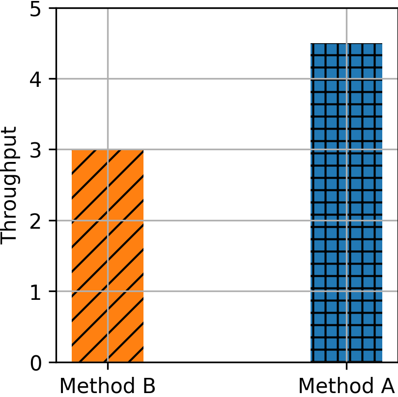

# Replicating: "Re-architecting datacenter networks and stacks for low latency and high performance"

**Team Members:**  
Davide Collovigh (davide.collovigh@mail.polimi.it);

---

**Source Paper:**
Mark Handley, Costin Raiciu, Alexandru Agache, Andrei Voinescu, Andrew W. Moore, Gianni Antichi, Marcin Wójcik: Re-architecting datacenter networks and stacks for low latency and high performance. In "SIGCOMM '17", "Association for Computing Machinery".


**Project:**
[NDP](https://github.com/Dav-11/NDP)

---

# 1. Introduction

The paper proposes a new data-center transport architecture called NDP (). This architecture, they say, achieves near-optimal completion
times for short transfers and high flow throughput in a wide range of scenarios, including incast.
NDP is designed to work in datacenters using redundant (clos-like) topologies, and requires some operations to be carried out by switches.


## 1.1 The problem
The problem this paper tries to address is the design of an architecture that can target both low latency and high throughput. In datacenter networks latency sensitive workloads and high throughput workloads coexists. Some examples of these workloads can be:
- High throughput workloads:
  - Remote disks in virtualization (storage for VMs is not located on the same server as the VM).
  - Distributed Storage (Storage is replicated between servers).
  - Backups and replications.
  - Data movement between computing nodes in AI training workload.
- Latency sensitive workloads:
  - Database queries
  - RPC requests
  - Video/audio streaming

Since datacenters want to support the widest range of workloads it is a very valuable result for them.

## 1.2 The solution
To fully satisfy these goals, NDP impacts the whole stack, including switch behavior, routing, and a completely new transport protocol.
<!-- - A Clos topology has sufficient bandwidth in the core to satisfy all demand, so long as it is perfectly load-balanced.
- per-packet multipath load-balancing.
  - the path is decided by the sender: Each NDP sender takes the list of paths to a destination, randomly permutes it, then sends packets on paths in this order. After it has sent one packet on each path, it randomly permutes the list of paths again, and the process repeats.
- To achieve minimal short-flow latency, senders cannot probe before sending: they must send the first RTT at line rate.
- Switchas have two queues:
  - To guarantee low latency, switch queues must be small.
  - packet queue (lower priority)
  - headers + control packets (higher priority).
  - The switch performs weighted round robin between the high priority “header queue” and the lower priority “data packet queue” with a 10:1 ratio of headers to packets.
- Arriving trimmed headers tell the receiver exactly what the demand is, so by using a receiver-pulled protocol, the receiver can then precisely control incoming traffic.
- The receiver will need to reorder packets as per packet load-balancing will not guarantee ordering. -->

NDP maximizes Clos topology utilization via per-packet multipath spraying, where senders randomly permute shortest paths for each packet, leaving the receiver to reorder them. Senders transmit the first RTT of a flow at line rate to eliminate startup delay. When shallow switch buffers overflow, the switch trims packet payloads and forwards only the headers. Utilizing a dual-priority queue system, switches prioritize these trimmed headers and control packets (like PULLs) over data using a 10:1 weighted round robin scheduler. Armed with a clear view of demand from these arriving headers, the receiver uses a pull-based transport protocol to precisely pace incoming data, achieving near-optimal congestion control and incast mitigation.


## 1.3 Contributions
The paper's main contribution is the architecture's design.
Inside the code repository for this project there are:
- the code for the simulations used in the paper
- POC implementations of the NDP switch (using P4 and netFPGA)
- POC implementation of the host code using DPDK.


# 2. Selected Result

This report is mainly focused on the **Large scale incast** experiment, which can be found in chapter 6.2 of the paper.

In this result, the authors try to stress test the resistence of the architecture in extreme incast conditions, and measure the time overhead (Fig. 20a) and the number of retransmitted packets (Fig. 20b). In both figures the x axis is the number of incast flows, ranging from 1 (no incast) to 8.000 flows, each of 30 pakets (270.000 Bytes).

## 2.1 Latency increase in incast scenarios (Incast sensitivity)


<center>
  
  <p>Figure 20 a: The figure shows </p>
</center>

Fig. 20a shows the time overhead as a percentage of the best theoretical last-flow completion time; this assumes the link to the receiver is completely saturated until the last flow finishes, and every packet is received only once.
With a 23 packet IW, small incasts see the worst overheads, but still finish within 2% of optimal.
For larger incasts, the time overhead is negligible.

<!-- todo: explain better -->


## 2.2 Packet retransmission in incast scenarios (Incast overhead)


<center>
  
  <p>Figure 20 b: The figure shows that method A improves throughput compared to method B</p>
</center>

Fig. 20b shows the mean number of retransmissions per packet, and the mechanism (return-to-sender bounce or NACK) by which the sender was informed of the need to resend. For smaller incasts, NACKs are the main mechanism.
Above 100 flows, return-to-sender becomes the main mechanism.
Above 2000 flows, some packets suffer a second return-to-sender before getting through.
Even with the largest incasts and a 23 packet IW, the mean number of retransmissions barely exceeds one.
However, it would make sense for applications that know they will create a large incast to reduce the initial window.

<!-- todo: explain better -->

# 3. Environment Setup

## 3.1 Hardware Environment

### Main setup
All my experiments were run on a mac:
- OS: MacOS 26.6.1 (Tahoe)
- Kernel: Darwin Kernel Version 25.6.0
- CPU: Apple M3 Pro (arm64)
- RAM: 36G

### Alternative setup
Some experiments were also run on a VM with this specifications, but simulations takes too much to run.

- OS: Debian 13.6 (Trixie)
- Kernel: 6.12.100+deb13-amd64
- CPU: 4xIntel Xeon E5-2620 v2 (virtualized in KVM)
- RAM: 8.0 GiB (DDR3)


## 3.2 Software Environment
- clang: Apple clang version 21.0.0 (using default mac aliasing so that it works by using `g++`)
```shell
myuser@mac $ g++ --version
Apple clang version 21.0.0 (clang-2100.1.1.101)
Target: arm64-apple-darwin25.6.0
Thread model: posix
InstalledDir: /Library/Developer/CommandLineTools/usr/bin
```
- make: GNU Make 3.81
- python: Python 3.14.6

## 3.3 Build
The simulator and experiments are built by following this [wiki](https://github.com/nets-cs-pub-ro/NDP/wiki/NDP-Simulator)

## 3.4 Deviations from the Original Setup
To make the experiment work correctly some edits were made to the script that runs the experiment (`sim/EXAMPLES/incast_scaling/run.sh`):
- changed shebang for scripts from `#!/bin/sh` to `#!/bin/bash`
- Added `#include <algorithm>` to sim/parse_output.cpp to fix compilation under newer Clang/libc++ versions, which removed transitive inclusion of `<algorithm>` from other standard headers. [source](https://libcxx.llvm.org/DesignDocs/HeaderRemovalPolicy.html)
- changed `python` to `python3`
- Changed `sim/EXAMPLES/incast_scaling/process_data_incast_conns.py` to work with python3:
  ```python
  - print(conns, lasttimes[numflows/2], file=ofile);
  - print(conns, lasttimes[numflows/2]);
  + print(conns, lasttimes[numflows//2], file=ofile);
  + print(conns, lasttimes[numflows//2]);
  ```
- Added a line on top of `run.sh` to remove previous results (otherwise the graphs shows multiple lines of same colors)
  ```shell
  + rm -f incast_ndp_completion_times_* ts_incast* bounces* *.pdf
  ```
- Changed the plot files to output the graphs as PNG instead of PDF

# 4. Experiment Result

## 4.1 Execution procedure
1. Build the simulator
  ```shell
  cd sim
  make
  ```
2. Build the topologies
  ```shell
  cd sim/datacenter
  make
  ```
3. Run the experiment
  ```shell
  cd sim/EXAMPLES/incast_scaling
  ./run.sh
  ```
4. Wait until finishes (on my setup it takes some hours)


## 4.x Comparing results
The results I obtained are not the same as the one in the paper (which again are different from the one included in the repository)


> Explain how your experiment was conducted and then what results you acquired. 
Afterwards, compare your results with those of the paper and state your
takeaways.

Step-by-step description:

1. Execution procedure
1. Measurement method
1. Number of runs
1. Statistical treatment (mean, median, CI, etc.)

Also Describe:

- How did you ensure correctness (did you check also other metrics to make sure the experiment is running correctly?)
- Did you do any debugging? Discuss issues you faced and how you overcame them (if applicable consider allocating a subsection for this item) 

Share your result and compare them with the paper's. Then discuss your takeaways.

For comparison include:

- Graph(s) or table(s)
- Matching axes and units with the source paper
- Error bars if applicable
- You may want to report difference with the original results (e.g., absolute
number or percentage).

For example:

<center>
  <div style="display:inline-block; width:30%;">
    
    <p>Figure 2: The figure shows that method A improves throughput compared to method B</p>
  </div>
  <div style="display:inline-block; width:30%; padding-left: 1em">
    
    <p>Figure 3: Our reproduction of Figure 1 shows results with the similar trend as claimed by the paper</p>
  </div>
</center>

> **Reminder:** the goal is not achieve the exact results of the paper, but to do a rigorous experiment with similar assumptions from the source paper and gain insight. The insight can be correctness of work, failure to reproduce same results, or even infeasibility of doing such experiment for interesting reasons.

# 5. Further Exploration

In this project you are required to also explore a research question of your own. Either:

1. Take the same test with different input workload or a variation of a test that is not present in the paper and comment the results you obtain
1. Implement a new feature on top of the system you evaluated and show a figure showing the performance

Discuss which approach you take, and what you explored. Explain what was your
motivation and importance of your question.

## 5.1. Methodology and Result

Report the experiment you designed for answering the question and share the
result you got.

Include:

- Graph(s) or table(s)
- How the experiment was conducted (share the details)
- What did you discover?

# 6. Reproducibility Assessment of the Paper

Evaluate the paper itself:

- Was the methodology clearly described?
- Was the artifact usable?
- How difficult was reproduction?

# 7. Conclusion

Conclude the report by mentioning the takeaways of experiments you did


---

# Appendix

You are asked to write this report using Markdown. You can find a cheat sheet
of Markdown syntax at this [link](https://rust-lang.github.io/mdBook/format/markdown.html).

For generating a PDF file from your report you can use a tool of your choice.
*md2pdf* is one such tool. See this [link](https://pypi.org/project/md2pdf/)
for more information about it. You can also use an online editor such as [this](https://www.md2pdf.io/).

